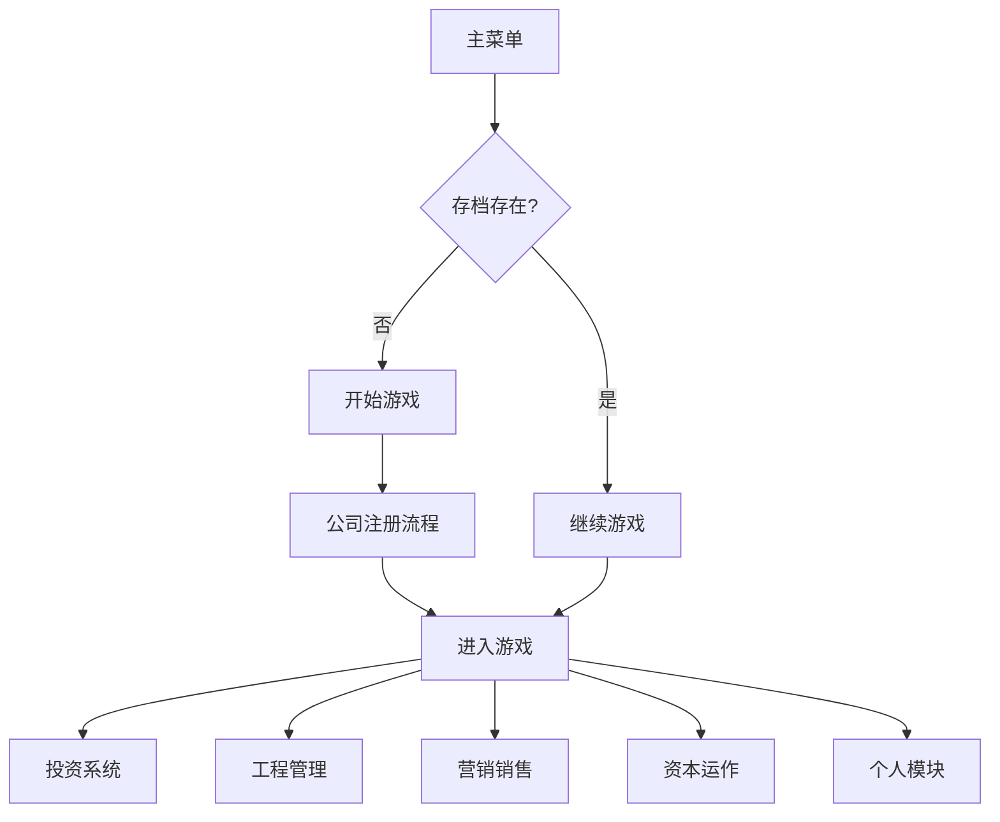

# 房地产帝国 - Vue3重构项目 PRD

## 1. Product Overview
中国房地产2008-2028全行业真实流程模拟游戏，从公司注册到上市运营的全链路体验

- 目标用户：对中国房地产行业感兴趣的模拟经营游戏玩家
- 核心价值：真实复现中国房地产开发全流程，提供沉浸式商业模拟体验

## 2. Core Features

### 2.1 User Roles
| Role | Registration Method | Core Permissions |
|------|---------------------|------------------|
| 玩家 | 游戏内注册 | 完整游戏体验 |

### 2.2 Feature Module
1. **主菜单系统**: 城市天际线背景、版本号、功能按钮
2. **公司注册流程**: 11步线性注册流程
3. **投资系统**: 土地竞拍、土地储备、多种拿地方式
4. **资产交易系统**: 土地、在建工程、自持物业、股权交易
5. **工程管理系统**: 全流程开发、五证办理
6. **营销销售系统**: 认筹、开盘、销售策略
7. **运营管理系统**: 自持物业、物业、代建
8. **资本运作系统**: 融资、股权、上市、三道红线
9. **个人模块**: 个人资产、人脉、能力、风险
10. **品牌模块**: 品牌建设、声誉、授权
11. **治理系统**: 高管、组织、风控、审计
12. **基础支撑**: 财务、宏观、政策、AI竞品、成就、排行榜

### 2.3 Page Details
| Page Name | Module Name | Feature description |
|-----------|-------------|---------------------|
| 主菜单 | Hero区域 | 天际线背景、游戏标题、副标题、版本号 |
| 主菜单 | 功能按钮 | 继续游戏、开始游戏、存档管理、更新日志、设置 |
| 公司注册 | 选择地区 | 31个省份按7大区域分组展示 |
| 公司注册 | 公司核名 | 字号输入、查重机制、企业名称生成 |
| 公司注册 | 企业性质 | 3种企业类型选择、优缺点说明 |
| 公司注册 | 股权架构 | 股东设置、持股比例调整 |
| 公司注册 | 注册资本 | 注册资本与实缴比例设置 |
| 公司注册 | 工商登记 | 自动生成企业信息、费用扣除 |
| 公司注册 | 刻章 | 必刻印章与可选印章选择 |
| 公司注册 | 银行开户 | 4家银行选择、开立基本账户 |
| 公司注册 | 税务登记 | 税种核定、税控设备购买 |
| 公司注册 | 资质申请 | 人员招聘、资质审批 |
| 投资 | 土地市场总览 | 热力图、指标看板、土拍日历 |
| 投资 | 土地竞拍 | 地块详情、情报系统、全模式竞拍 |
| 投资 | 土地储备 | 地块管理、价值评估、开发计划 |
| 游戏主界面 | 底部导航 | 12个模块导航栏 |
| 游戏主界面 | 顶部状态栏 | 日期、时间、核心指标 |

## 3. Core Process

### 主游戏流程

### 公司注册流程

## 4. User Interface Design

### 4.1 Design Style
- **主色调**: 深蓝色(#0d1b2a) + 金色(#FBBF24至#D4AF37渐变)
- **按钮风格**: 卡片式, `bg-game-card/80 hover:bg-game-primary/30 rounded-lg py-3 px-6`
- **字体**: 加粗无衬线艺术字体(标题), 无衬线字体(正文)
- **布局风格**: 现代化卡片布局, 响应式设计
- **动画**: 平滑过渡, 入场动画序列

### 4.2 Page Design Overview
| Page Name | Module Name | UI Elements |
|-----------|-------------|-------------|
| 主菜单 | Hero区域 | 天际线背景+蓝图线稿, 70%黑色遮罩, 金色渐变标题, 白色副标题 |
| 主菜单 | 功能按钮 | 垂直居中卡片式按钮, hover效果, 高亮显示继续游戏 |
| 公司注册 | 选择地区 | 7大区域分组, 省份卡片显示指标 |
| 投资 | 土地竞拍 | 地块详情卡片, 情报系统标签页, 出价界面 |
| 游戏主界面 | 底部导航 | 两行网格导航, 图标+文字 |

### 4.3 Responsiveness
- Mobile-first design, adaptive to all resolutions
- Touch-optimized buttons (&gt;=44px touch area)
- Safe area handling for notch screens
- Landscape mode support

### 4.4 Special Features
- 无独立事件列表页面, 所有事件仅通过弹窗、数值变化与系统提示展现
- 完全兼容玩家现有存档, 不做破坏性改动
- 无任何真实企业、机构、人名信息
